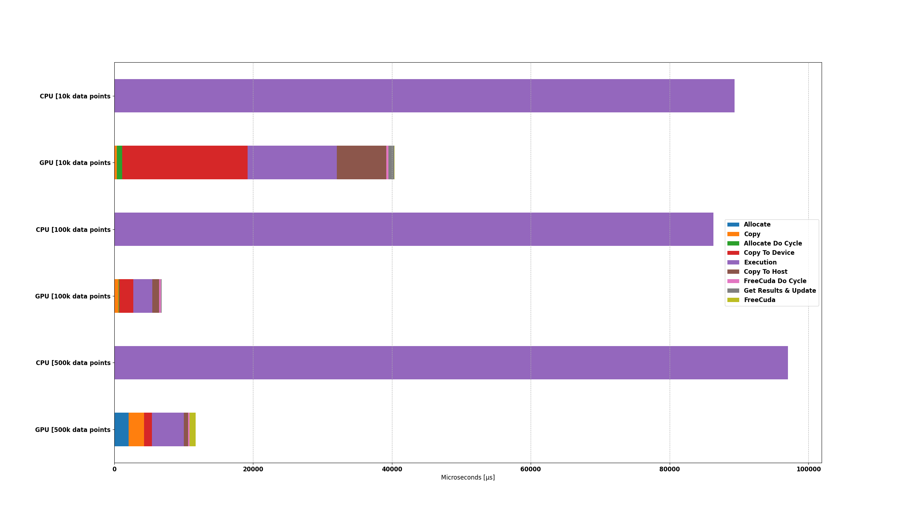
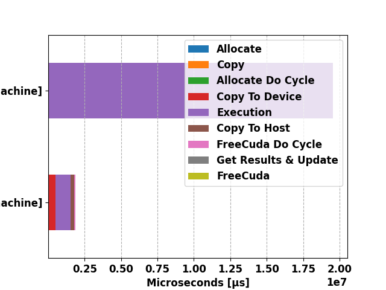

# HPCA-Linear-Regression

Project for High Prfromance Computer Architecture
CPUs/GPUs Comparison of Multi Linear Regression Algorithm

An analysis of a High-Performance Computer Architecture project focused on comparing the performance of linear regression algorithms on both CPU and GPU architectures. The objective of the project was to explore the potential acceleration benefits offered by GPU computing for linear regression tasks.

-> Link to the report [HERE](https://duccioo.github.io/HPCA-Linear-Regression/HPCA___Project_Report.pdf)

## Prerequisites:

for the main_LR.cu script:

- nvcc compiler
- **CUDA 11.5**

## Description of the file

1. `script/main_LR.cu`: this is the main file that allow to run the algorithm of the linear regression.
   This automatically execute the CPU and the GPU version of the algorithm.
   You can specify an external dataset and it automatically counts the total number of items in the dataset in `".csv"` format (skip the first line), more on this in the Usage/Examples section below.
   The script returns the results of the elapsed time in file saved in `/result` folder of the cpu and gpu parameters.

2. `script/linear_regression4d.cuh`: this file contains the kernel for the linear regresion algorithm for the GPU implementation.
   This file is used in the main_dataset.cu file.

3. `script/utils_python/data_analysis.py`: allow to plot graphically the mean of the multiple run saved on the file in the
   folder `/result`, if multiple files are present in the folder, the script automatically plots all the data in the same plot.

4. `script/utils_python/norm.py`: the `norm.py` script allow to normalize the dataset in input.

5. `script/utils_python/gen_data.py`: this script allow to generate datasets in 4D, parameters like the Number of data must be specified in the file

6. `script/utils_python/test.py`: this file allow to test the performance of founded parameters of the regresions.
   The parameters like: _intercept_, _slope1_, _slope2_ and _slope3_ must be specified in the file.
   Then it returns the Accuracy.ls

## Dataset

The default dataset (`data/mock_dataset/train.csv` and `data/mock_dataset/test.csv`) was taken from the [@lianaling](https://github.com/lianaling/dspc-cuda/blob/main/dspc-cuda/mock.csv) repo and it's a _.csv_ file with this parameter:

- name
- points
- skill
- assists
- salary

Dummy datasets were also generated to test the code using the `gen_data.py` script with 4 dimensions and are located in `data/generated_dataset/4D/` folder

## Installation Python scripts

In order to run all the script you need the following:

for the python scripts:

```bash
 pip install -r requirements.txt
```

## Run Locally

Clone the project

```bash
  git clone https://github.com/Duccioo/HPCA-Linear-Regression.git
```

Go to the project directory

```bash
  cd HPCA-Linear-Regression/script
```

Compiling the main code:

```bash
  nvcc -o main_LR main_LR.cu
```

## Usage/Examples

Make sure you are in the correct directory, i.e.: `"HPCA-Linear-Regression/script"`

To execute with the default dataset locateted in `"/data/mock_dataset/train.csv"`

```bash
  ./main_LR
```

or if you want to use external dataset:

```bash
  ./main_LR <path_to_external_dataset>
```

## Results

### Generated dataset:



### External dataset from [@lianaling](https://github.com/lianaling/dspc-cuda/blob/main/dspc-cuda/mock.csv):



## Authors

- [@macca0612](https://github.com/macca0612)
- [@duccioo](https://github.com/Duccioo)

## License

[MIT](https://choosealicense.com/licenses/mit/)
